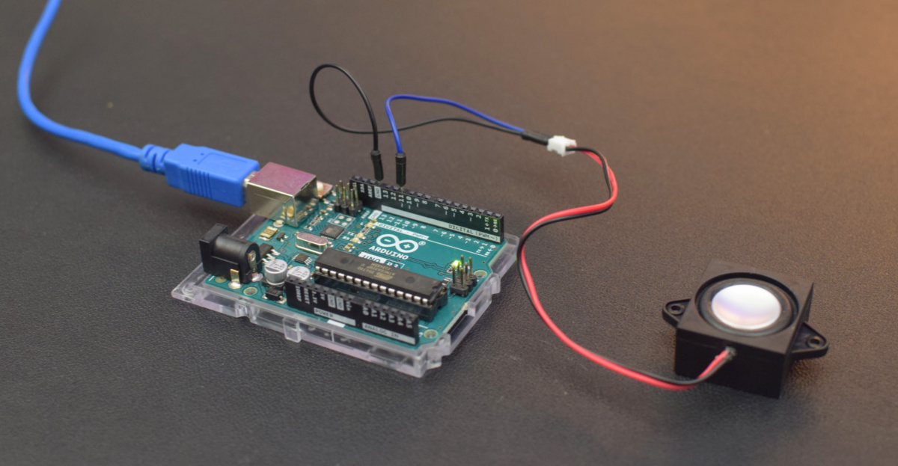

# NumberSpeaker

[](https://github.com/swharden/NumberSpeaker/actions/workflows/arduino.yaml)

**NumberSpeaker is an Arduino library for reading numbers using a speaker.** A human voice from WAV files is encoded into bytes which are stored in program memory and played back using PWM to drive a speaker. The audio waveforms are stored in memory and occupy about half of the Arduino's program space.

**Example (Video):** https://swharden.com/static/2023/08/19/numbers.webm



## Quickstart
* Connect a speaker to `pin 11`
* Open the Arduino IDE and create a new sketch
* Press `CTRL+SHIFT+i` to open the library manager
* Search for `NumberSpeaker` and select `Install`
* Paste the following into your sketch

```cpp
#include <NumberSpeaker.h>

NumberSpeaker numberSpeaker = NumberSpeaker();

void setup() {
  numberSpeaker.begin(); // connect a speaker to pin 11
}

void loop() {

  numberSpeaker.speak_int(1234567);
  delay(500);

  numberSpeaker.speak_float(123.4567);
  delay(500);

  numberSpeaker.speak_string("69.420.42");
  delay(500);

  numberSpeaker.speak_char('6');
  numberSpeaker.speak_char('.');
  numberSpeaker.speak_char('9');
  delay(500);

  for (;;) {}
}
```

## Additional Resources

* [Speaking Numbers with a Microcontroller](https://swharden.com/blog/2023-08-19-speaking-microcontroller/) - A blog post describing the strategy used to encode audio files, store them in program memory, and play them back using a speaker.

* [Play Audio from SPI Flash with a Microcontroller](https://swharden.com/blog/2023-08-26-spi-flash-audio/) - A blog post describing how to use a microcontroller to drive a speaker using PWM from audio levels stored in a SPI flash chip. This strategy is useful for users who wish to play longer audio clips or use less program memory.

* [Talkie](https://www.arduino.cc/reference/en/libraries/talkie/) is an official Arduino speech synthesis library. It is a software implementation of the [Texas Instruments speech synthesis architecture](https://en.wikipedia.org/wiki/Texas_Instruments_LPC_Speech_Chips) from the late 1970s. I found the voice to be poor quality for reading numbers, but it may be useful to users seeking more complex phrases or who are concerned about demands on program memory.